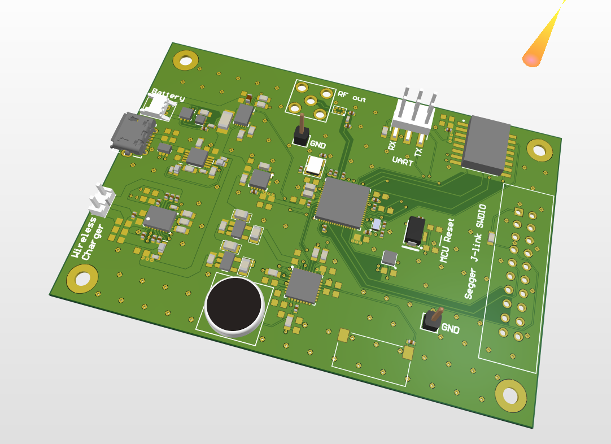

# Sensorboard hardware project
This is a sensorboard hardware project with wireless charging. This will be the base project of the future mcu hardware project.
The board is based on the STM32WB55 wireless MCU and has the following interfaces:
- Bluetooth 5/BLE
- QSPI flash
- Codec with I2S interface
- Mic and speaker
- 3 axis I2C accelerometer
- Connector for wireless charger
- Connector for battery

## TODO list:
- [ ] Documentation (block diagram)
- [x] Schematic design
- [x] PCB design 
- [ ] Fabrication
- [ ] PCB assembly
- [ ] Board bring-up
